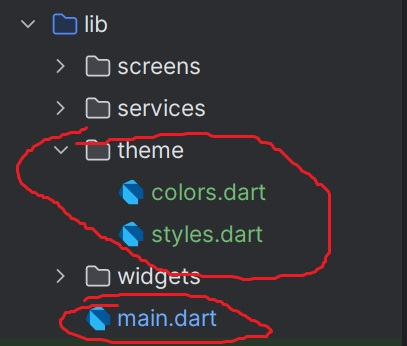

# Guide pratique GreenFund - Respect du thème


## 1️⃣ Règles importantes
1. **Ne jamais modifier** les fichiers dans `lib/theme/` (colors.dart, styles.dart).
2. **Ne jamais modifier** `main.dart`.
3. Toutes les pages et widgets doivent **utiliser les couleurs et styles définis** dans `AppColors` et `AppStyles`.


---

## 2️⃣ Couleurs à utiliser
- `AppColors.primaryGreen` → boutons, accents
- `AppColors.lightGreen` → bordures, fonds légers
- `AppColors.darkGreen` → textes secondaires ou hover
- `AppColors.background` → fond global des écrans
- `AppColors.textDark` / `AppColors.textLight` → texte principal / texte clair

⚠️ Ne jamais utiliser `Color(0xFF...)` directement dans vos pages.

---

## 3️⃣ Styles à utiliser
## exemple
# import '../theme/colors.dart';
# import '../theme/styles.dart';

```dart
TextField(
  controller: myController,
  decoration: AppStyles.inputDecoration('Nom du champ'),
)
ElevatedButton(
  style: AppStyles.greenButton,
  onPressed: () {},
  child: Text('Valider'),
)
Card(
  shape: AppStyles.projectCardTheme.shape,
  elevation: AppStyles.projectCardTheme.elevation,
  margin: AppStyles.projectCardTheme.margin,
  child: ListTile(
    title: Text('Projet solaire', style: AppStyles.titleText),
    subtitle: Text('Type: Solaire', style: AppStyles.subtitleText),
  ),
)


